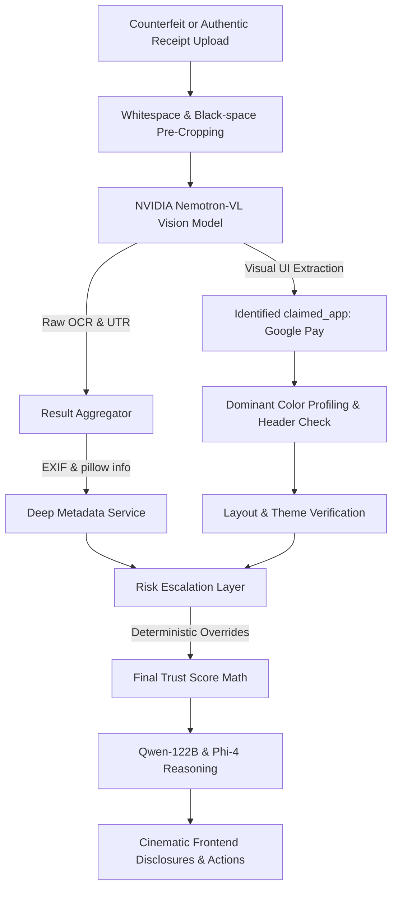

# TrustLayer AI — Payment Proof Forensics

> **The Trust Verification Layer for Digital Payments**
> 
> TrustLayer AI is a premium, high-fidelity security scanner designed to detect, analyze, and flag counterfeit UPI payment screenshots and digital transaction receipts. Using a hybrid system of deterministic color/layout forensics, deep metadata history audits, and multi-model visual AI reasoning, TrustLayer AI protects merchants from cloned screens and receipt tampering.

---

## 🌌 Key Highlights & Features

### 1. 🔍 Advanced Visual UI-Based App Recognition
* **Differentiated App Extraction:** Leverages state-of-the-art vision models (**NVIDIA Nemotron-VL-8B**) to classify and verify the container app by scanning branding icons, logos, header colors, and font families rather than getting confused by destination handles (e.g. a customer paying *to* a `@paytm` VPA from **Google Pay** is correctly classified as a GPay screenshot).
* **Multi-App Footprints:** Deep color and structural layout verification for all major Indian payment platforms:
  * **PhonePe** (Purple `#5f259f` theme matching)
  * **Paytm** (Cyan `#00baf2` banner verification)
  * **Google Pay** (Clean material layouts & signature confirmation checks)
  * **FamPay** & **CRED** (Sleek dark-glassmorphic and youth-focused templates)
  * **super.money** (Flipkart-group signature neon green success formats)
  * **Pop UPI** (Orange success gradients)
  * **Navi** & **Mobikwik** (Lime success metrics)
  * **Corporate Banking Apps** (SBI YONO, HDFC, ICICI iMobile, Kotak, etc.)

### 2. 🛡️ Deterministic Escalation & Hard Overrides
* **Strict UTR Format Check:** Demands exact 12-digit Indian UPI transaction reference formatting. Counterfeits containing dummy reference IDs (e.g. `45357172`) instantly drop the Trust Score to **15/100** and trigger a **HIGH RISK** alert.
* **Foreign Currency Protection:** UPI strictly handles Indian Rupees (`₹`). Automatic dual-insurance verification flags any foreign currency symbols (`$`, `€`, `£`, `usd`) visible in either the extracted fields or raw OCR blocks as an immediate visual tampering override.
* **Aspect Ratio Padding Crop:** solid black/white canvas padding added by scammers is pre-cropped out, preventing canvas aspect ratio or header color counters from being bypassed.

### 3. 💾 Deep Metadata History Forensics
* **Compression & Software Audit:** Scans raw binary headers and complete image text chunks for signature remnants of editing software (*Photoshop, Canva, PicsArt, Figma, GIMP, Snapseed, PicsArt, etc.*).
* **Compression Profile matching:** Detects inconsistencies in pixel compression clusters indicating timestamp overlays.

### 4. 🧠 Multi-Model AI Reasoning
* **Paced Cinematic Diagnostics:** Renders a gorgeous neon laser-line scan overlay and conic-gradient radar sweep on the frontend, pacing the user through real-time pipeline milestones (OCR extraction -> Qwen layout check -> pixel profiling -> hash matches).
* **Refined Bullet Explanations:** Employs **Qwen-3.5-122B** and **Phi-4** reasoning models, constrained strictly to generate short, punchy, single-sentence forensic insights.

---

## 🛠️ Architecture & Tech Stack



* **Frontend:** Next.js (App Router), React, Tailwind-free premium Vanilla CSS (dark mode, glassmorphism, responsive micro-animations).
* **Backend:** FastAPI, Python, Pillow (pixel manipulation & EXIF recursive analysis).
* **AI Engine:** NVIDIA NIM APIs (Nemotron-VL, Qwen-3.5-122B, Microsoft Phi-4).

---

## 🚀 Quick Start (Local Run)

### Prerequisites
1. Ensure your system has Node.js (v18+) and Python 3.10+ installed.
2. Clone the repository and configure a `.env` file in the root:
   ```env
   NVIDIA_API_KEY=your_nvidia_nim_api_key
   NVIDIA_BASE_URL=https://integrate.api.nvidia.com/v1
   OCR_MODEL=nvidia/llama-3.1-nemotron-nano-vl-8b-v1
   QWEN_MODEL=qwen/qwen3.5-122b-a10b
   FALLBACK_MODEL=microsoft/phi-4-mini-instruct
   ```

### 1. Start the FastAPI Backend
```bash
# Install python dependencies
pip install -r requirements.txt

# Run FastAPI app
python -m uvicorn backend.main:app --port 8000
```
FastAPI endpoints will be live at `http://localhost:8000`. You can access the standard interactive Swagger UI at `/docs`.

### 2. Start the Next.js Frontend
```bash
# Install packages
npm install

# Run next dev server
npm run dev
```
Open [http://localhost:3000/product](http://localhost:3000/product) with your browser to experience the forensic scanner!

---

## 🧪 One-Click Demo Mode (No Download Required)
To evaluate the end-to-end pipeline instantly without needing local receipts, simply click the **"Load Demo Screenshot"** option inside the upload dashboard. This synthesizes and base64-encodes a high-fidelity vector SVG of a real PhonePe receipt directly on the client, ready to test the entire active scan diagnostics pipeline.

---

## ⚖️ License
Released under the MIT License. Built for payment verification excellence.
